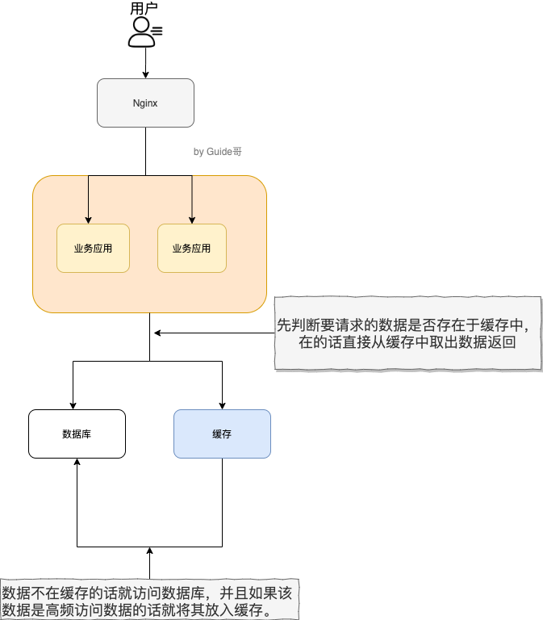
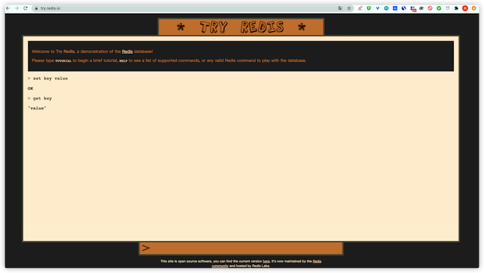
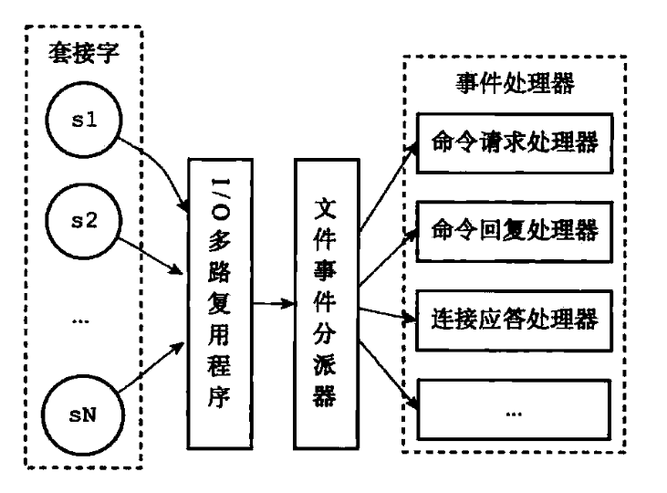
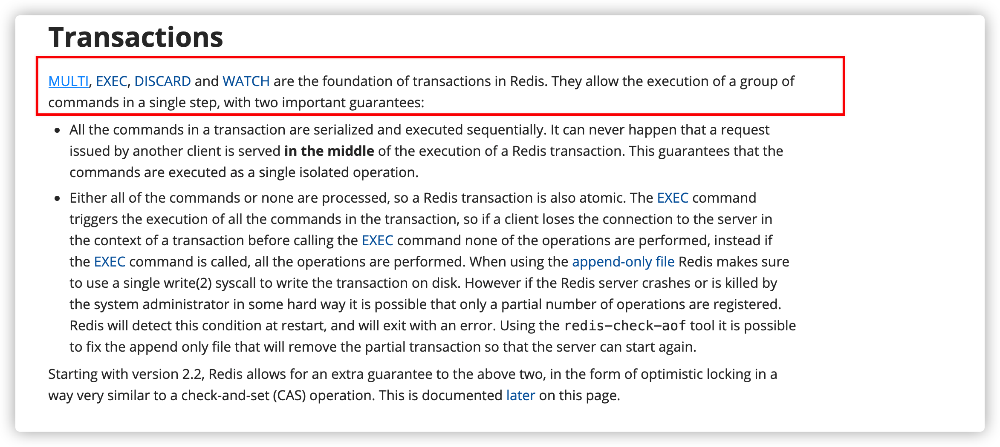
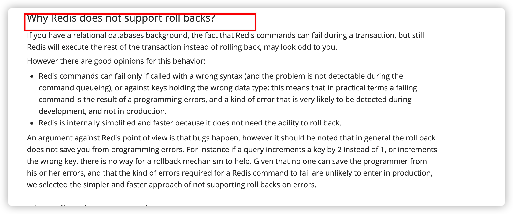

点击关注[公众号](#公众号)及时获取笔主最新更新文章，并可免费领取本文档配套的《Java 面试突击》以及 Java 工程师必备学习资源。


<!-- @import "[TOC]" {cmd="toc" depthFrom=1 depthTo=6 orderedList=false} -->

<!-- code_chunk_output -->

- [1. 简单介绍一下 Redis 呗!](#1-简单介绍一下-redis-呗)
- [2. 分布式缓存常见的技术选型方案有哪些？](#2-分布式缓存常见的技术选型方案有哪些)
- [3. 说一下 Redis 和 Memcached 的区别和共同点](#3-说一下-redis-和-memcached-的区别和共同点)
- [4. 缓存数据的处理流程是怎样的？](#4-缓存数据的处理流程是怎样的)
- [5. 为什么要用 Redis/为什么要用缓存？](#5-为什么要用-redis为什么要用缓存)
- [6. Redis 常见数据结构以及使用场景分析](#6-redis-常见数据结构以及使用场景分析)
  - [6.1. string](#61-string)
  - [6.2. list](#62-list)
  - [6.3. hash](#63-hash)
  - [6.4. set](#64-set)
  - [6.5. sorted set](#65-sorted-set)
- [7. Redis 单线程模型详解](#7-redis-单线程模型详解)
- [8. Redis 没有使用多线程？为什么不使用多线程？](#8-redis-没有使用多线程为什么不使用多线程)
- [9. Redis6.0 之后为何引入了多线程？](#9-redis60-之后为何引入了多线程)
- [10. Redis 给缓存数据设置过期时间有啥用？](#10-redis-给缓存数据设置过期时间有啥用)
- [11. Redis是如何判断数据是否过期的呢？](#11-redis是如何判断数据是否过期的呢)
- [12. 过期的数据的删除策略了解么？](#12-过期的数据的删除策略了解么)
- [13. Redis 内存淘汰机制了解么？](#13-redis-内存淘汰机制了解么)
- [14. Redis 持久化机制(怎么保证 Redis 挂掉之后再重启数据可以进行恢复)](#14-redis-持久化机制怎么保证-redis-挂掉之后再重启数据可以进行恢复)
- [15. Redis 事务](#15-redis-事务)
- [16. 缓存穿透](#16-缓存穿透)
  - [16.1. 什么是缓存穿透？](#161-什么是缓存穿透)
  - [16.2. 缓存穿透情况的处理流程是怎样的？](#162-缓存穿透情况的处理流程是怎样的)
  - [16.3. 有哪些解决办法？](#163-有哪些解决办法)
- [17. 缓存雪崩](#17-缓存雪崩)
  - [17.1. 什么是缓存雪崩？](#171-什么是缓存雪崩)
  - [17.2. 有哪些解决办法？](#172-有哪些解决办法)
- [18. 如何保证缓存与数据库双写时的数据一致性?](#18-如何保证缓存与数据库双写时的数据一致性)
- [19. 参考](#19-参考)
- [20. 公众号](#20-公众号)

<!-- /code_chunk_output -->


### 1. 简单介绍一下 Redis 呗!

简单来说 **Redis 就是一个使用 C 语言开发的数据库**，不过与传统数据库不同的是 **Redis 的数据是存在内存中的** ，也就是它是内存数据库，所以读写速度非常快，因此 Redis 被广泛应用于缓存方向。

另外，**Redis 除了做缓存之外，Redis 也经常用来做分布式锁，甚至是消息队列。**

**Redis 提供了多种数据类型来支持不同的业务场景。Redis 还支持事务 、持久化、Lua 脚本、多种集群方案。**

### 2. 分布式缓存常见的技术选型方案有哪些？

分布式缓存的话，使用的比较多的主要是 **Memcached** 和 **Redis**。不过，现在基本没有看过还有项目使用 **Memcached** 来做缓存，都是直接用 **Redis**。

Memcached 是分布式缓存最开始兴起的那会，比较常用的。后来，随着 Redis 的发展，大家慢慢都转而使用更加强大的 Redis 了。

分布式缓存主要解决的是单机缓存的容量受服务器限制并且无法保存通用的信息。因为，本地缓存只在当前服务里有效，比如如果你部署了两个相同的服务，他们两者之间的缓存数据是无法共同的。

### 3. 说一下 Redis 和 Memcached 的区别和共同点

现在公司一般都是用 Redis 来实现缓存，而且 Redis 自身也越来越强大了！不过，了解 Redis 和 Memcached 的区别和共同点，有助于我们在做相应的技术选型的时候，能够做到有理有据！

**共同点** ：

1. 都是基于内存的数据库，一般都用来当做缓存使用。
2. 都有过期策略。
3. 两者的性能都非常高。

**区别** ：

1. **Redis 支持更丰富的数据类型（支持更复杂的应用场景）**。Redis 不仅仅支持简单的 k/v 类型的数据，同时还提供 list，set，zset，hash 等数据结构的存储。Memcached 只支持最简单的 k/v 数据类型。
2. **Redis 支持数据的持久化，可以将内存中的数据保持在磁盘中，重启的时候可以再次加载进行使用,而 Memecache 把数据全部存在内存之中。**
3. **Redis 有灾难恢复机制。** 因为可以把缓存中的数据持久化到磁盘上。
4. **Redis 在服务器内存使用完之后，可以将不用的数据放到磁盘上。但是，Memcached 在服务器内存使用完之后，就会直接报异常。**
5. **Memcached 没有原生的集群模式，需要依靠客户端来实现往集群中分片写入数据；但是 Redis 目前是原生支持 cluster 模式的.**
6. **Memcached 是多线程，非阻塞 IO 复用的网络模型；Redis 使用单线程的多路 IO 复用模型。** （Redis 6.0 引入了多线程 IO ）
7. **Redis 支持发布订阅模型、Lua 脚本、事务等功能，而 Memcached 不支持。并且，Redis 支持更多的编程语言。**
8. **Memcached过期数据的删除策略只用了惰性删除，而 Redis 同时使用了惰性删除与定期删除。**

相信看了上面的对比之后，我们已经没有什么理由可以选择使用 Memcached 来作为自己项目的分布式缓存了。

### 4. 缓存数据的处理流程是怎样的？

作为暖男一号，我给大家画了一个草图。


简单来说就是:

1. 如果用户请求的数据在缓存中就直接返回。
2. 缓存中不存在的话就看数据库中是否存在。
3. 数据库中存在的话就更新缓存中的数据。
4. 数据库中不存在的话就返回空数据。

### 5. 为什么要用 Redis/为什么要用缓存？

_简单，来说使用缓存主要是为了提升用户体验以及应对更多的用户。_

下面我们主要从“高性能”和“高并发”这两点来看待这个问题。



**高性能** ：

对照上面 👆 我画的图。我们设想这样的场景：

假如用户第一次访问数据库中的某些数据的话，这个过程是比较慢，毕竟是从硬盘中读取的。但是，如果说，用户访问的数据属于高频数据并且不会经常改变的话，那么我们就可以很放心地将该用户访问的数据存在缓存中。

**这样有什么好处呢？** 那就是保证用户下一次再访问这些数据的时候就可以直接从缓存中获取了。操作缓存就是直接操作内存，所以速度相当快。

不过，要保持数据库和缓存中的数据的一致性。 如果数据库中的对应数据改变的之后，同步改变缓存中相应的数据即可！

**高并发：**

一般像 MySQL 这类的数据库的 QPS 大概都在 1w 左右（4 核 8g） ，但是使用 Redis 缓存之后很容易达到 10w+，甚至最高能达到 30w+（就单机 redis 的情况，redis 集群的话会更高）。

> QPS（Query Per Second）：服务器每秒可以执行的查询次数；

所以，直接操作缓存能够承受的数据库请求数量是远远大于直接访问数据库的，所以我们可以考虑把数据库中的部分数据转移到缓存中去，这样用户的一部分请求会直接到缓存这里而不用经过数据库。进而，我们也就提高的系统整体的并发。

### 6. Redis 常见数据结构以及使用场景分析

你可以自己本机安装 redis 或者通过 redis 官网提供的[在线 redis 环境](https://try.redis.io/)。



#### 6.1. string

1. **介绍** ：string 数据结构是简单的 key-value 类型。虽然 Redis 是用 C 语言写的，但是 Redis 并没有使用 C 的字符串表示，而是自己构建了一种 **简单动态字符串**（simple dynamic string，**SDS**）。相比于 C 的原生字符串，Redis 的 SDS 不光可以保存文本数据还可以保存二进制数据，并且获取字符串长度复杂度为 O(1)（C 字符串为 O(N)）,除此之外,Redis 的 SDS API 是安全的，不会造成缓冲区溢出。
2. **常用命令:** `set,get,strlen,exists,dect,incr,setex` 等等。
3. **应用场景** ：一般常用在需要计数的场景，比如用户的访问次数、热点文章的点赞转发数量等等。

下面我们简单看看它的使用！

**普通字符串的基本操作：**

``` bash
127.0.0.1:6379> set key value #设置 key-value 类型的值
OK
127.0.0.1:6379> get key # 根据 key 获得对应的 value
"value"
127.0.0.1:6379> exists key  # 判断某个 key 是否存在
(integer) 1
127.0.0.1:6379> strlen key # 返回 key 所储存的字符串值的长度。
(integer) 5
127.0.0.1:6379> del key # 删除某个 key 对应的值
(integer) 1
127.0.0.1:6379> get key
(nil)
```

**批量设置** :

``` bash
127.0.0.1:6379> mest key1 value1 key2 value2 # 批量设置 key-value 类型的值
OK
127.0.0.1:6379> mget key1 key2 # 批量获取多个 key 对应的 value
1) "value1"
2) "value2"
```

**计数器（字符串的内容为整数的时候可以使用）：**

``` bash

127.0.0.1:6379> set number 1
OK
127.0.0.1:6379> incr number # 将 key 中储存的数字值增一
(integer) 2
127.0.0.1:6379> get number
"2"
127.0.0.1:6379> decr number # 将 key 中储存的数字值减一
(integer) 1
127.0.0.1:6379> get number
"1"
```

**过期**：

``` bash
127.0.0.1:6379> expire key  60 # 数据在 60s 后过期
(integer) 1
127.0.0.1:6379> setex key 60 value # 数据在 60s 后过期 (setex:[set] + [ex]pire)
OK
127.0.0.1:6379> ttl key # 查看数据还有多久过期
(integer) 56
```

#### 6.2. list

1. **介绍** ：**list** 即是 **链表**。链表是一种非常常见的数据结构，特点是易于数据元素的插入和删除并且且可以灵活调整链表长度，但是链表的随机访问困难。许多高级编程语言都内置了链表的实现比如 Java 中的 **LinkedList**，但是 C 语言并没有实现链表，所以 Redis 实现了自己的链表数据结构。Redis 的 list 的实现为一个 **双向链表**，即可以支持反向查找和遍历，更方便操作，不过带来了部分额外的内存开销。
2. **常用命令:** `rpush,lpop,lpush,rpop,lrange、llen` 等。
3. **应用场景:** 发布与订阅或者说消息队列、慢查询。

下面我们简单看看它的使用！

**通过 `rpush/lpop` 实现队列：**

``` bash
127.0.0.1:6379> rpush myList value1 # 向 list 的头部（右边）添加元素
(integer) 1
127.0.0.1:6379> rpush myList value2 value3 # 向list的头部（最右边）添加多个元素
(integer) 3
127.0.0.1:6379> lpop myList # 将 list的尾部(最左边)元素取出
"value1"
127.0.0.1:6379> lrange myList 0 1 # 查看对应下标的list列表， 0 为 start,1为 end
1) "value2"
2) "value3"
127.0.0.1:6379> lrange myList 0 -1 # 查看列表中的所有元素，-1表示倒数第一
1) "value2"
2) "value3"
```

**通过 `rpush/rpop` 实现栈：**

``` bash
127.0.0.1:6379> rpush myList2 value1 value2 value3
(integer) 3
127.0.0.1:6379> rpop myList2 # 将 list的头部(最右边)元素取出
"value3"
```

我专门花了一个图方便小伙伴们来理解：


**通过 `lrange` 查看对应下标范围的列表元素：**

``` bash
127.0.0.1:6379> rpush myList value1 value2 value3
(integer) 3
127.0.0.1:6379> lrange myList 0 1 # 查看对应下标的list列表， 0 为 start,1为 end
1) "value1"
2) "value2"
127.0.0.1:6379> lrange myList 0 -1 # 查看列表中的所有元素，-1表示倒数第一
1) "value1"
2) "value2"
3) "value3"
```

通过 `lrange` 命令，你可以基于 list 实现分页查询，性能非常高！

**通过 `llen` 查看链表长度：**

``` bash
127.0.0.1:6379> llen myList
(integer) 3
```

#### 6.3. hash

1. **介绍** ：hash 类似于 JDK1.8 前的 HashMap，内部实现也差不多(数组 + 链表)。不过，Redis 的 hash 做了更多优化。另外，hash 是一个 string 类型的 field 和 value 的映射表，**特别适合用于存储对象**，后续操作的时候，你可以直接仅仅修改这个对象中的某个字段的值。 比如我们可以 hash 数据结构来存储用户信息，商品信息等等。
2. **常用命令：** `hset,hmset,hexists,hget,hgetall,hkeys,hvals` 等。
3. **应用场景:** 系统中对象数据的存储。

下面我们简单看看它的使用！

``` bash
127.0.0.1:6379> hset userInfoKey name "guide" description "dev" age "24"
OK
127.0.0.1:6379> hexists userInfoKey name # 查看 key 对应的 value中指定的字段是否存在。
(integer) 1
127.0.0.1:6379> hget userInfoKey name # 获取存储在哈希表中指定字段的值。
"guide"
127.0.0.1:6379> hget userInfoKey age
"24"
127.0.0.1:6379> hgetall userInfoKey # 获取在哈希表中指定 key 的所有字段和值
1) "name"
2) "guide"
3) "description"
4) "dev"
5) "age"
6) "24"
127.0.0.1:6379> hkeys userInfoKey # 获取 key 列表
1) "name"
2) "description"
3) "age"
127.0.0.1:6379> hvals userInfoKey # 获取 value 列表
1) "guide"
2) "dev"
3) "24"
127.0.0.1:6379> hset userInfoKey name "GuideGeGe" # 修改某个字段对应的值
127.0.0.1:6379> hget userInfoKey name
"GuideGeGe"
```

#### 6.4. set

1. **介绍 ：** set 类似于 Java 中的 `HashSet` 。Redis 中的 set 类型是一种无序集合，集合中的元素没有先后顺序。当你需要存储一个列表数据，又不希望出现重复数据时，set 是一个很好的选择，并且 set 提供了判断某个成员是否在一个 set 集合内的重要接口，这个也是 list 所不能提供的。可以基于 set 轻易实现交集、并集、差集的操作。比如：你可以将一个用户所有的关注人存在一个集合中，将其所有粉丝存在一个集合。Redis 可以非常方便的实现如共同关注、共同粉丝、共同喜好等功能。这个过程也就是求交集的过程。
2. **常用命令：** `sadd,spop,smembers,sismember,scard,sinterstore,sunion` 等。
3. **应用场景:** 需要存放的数据不能重复以及需要获取多个数据源交集和并集等场景

下面我们简单看看它的使用！

``` bash
127.0.0.1:6379> sadd mySet value1 value2 # 添加元素进去
(integer) 2
127.0.0.1:6379> sadd mySet value1 # 不允许有重复元素
(integer) 0
127.0.0.1:6379> smembers mySet # 查看 set 中所有的元素
1) "value1"
2) "value2"
127.0.0.1:6379> scard mySet # 查看 set 的长度
(integer) 2
127.0.0.1:6379> sismember mySet value1 # 检查某个元素是否存在set 中，只能接收单个元素
(integer) 1
127.0.0.1:6379> sadd mySet2 value2 value3
(integer) 2
127.0.0.1:6379> sinterstore mySet3 mySet mySet2 # 获取 mySet 和 mySet2 的交集并存放在 mySet3 中
(integer) 1
127.0.0.1:6379> smembers mySet3
1) "value2"
```

#### 6.5. sorted set

1. **介绍：** 和 set 相比，sorted set 增加了一个权重参数 score，使得集合中的元素能够按 score 进行有序排列，还可以通过 score 的范围来获取元素的列表。有点像是 Java 中 HashMap 和 TreeSet 的结合体。
2. **常用命令：** `zadd,zcard,zscore,zrange,zrevrange,zrem` 等。
3. **应用场景：** 需要对数据根据某个权重进行排序的场景。比如在直播系统中，实时排行信息包含直播间在线用户列表，各种礼物排行榜，弹幕消息（可以理解为按消息维度的消息排行榜）等信息。

``` bash
127.0.0.1:6379> zadd myZset 3.0 value1 # 添加元素到 sorted set 中 3.0 为权重
(integer) 1
127.0.0.1:6379> zadd myZset 2.0 value2 1.0 value3 # 一次添加多个元素
(integer) 2
127.0.0.1:6379> zcard myZset # 查看 sorted set 中的元素数量
(integer) 3
127.0.0.1:6379> zscore myZset value1 # 查看某个 value 的权重
"3"
127.0.0.1:6379> zrange  myZset 0 -1 # 顺序输出某个范围区间的元素，0 -1 表示输出所有元素
1) "value3"
2) "value2"
3) "value1"
127.0.0.1:6379> zrange  myZset 0 1 # 顺序输出某个范围区间的元素，0 为 start  1 为 stop
1) "value3"
2) "value2"
127.0.0.1:6379> zrevrange  myZset 0 1 # 逆序输出某个范围区间的元素，0 为 start  1 为 stop
1) "value1"
2) "value2"
```

### 7. Redis 单线程模型详解

**Redis 基于 Reactor 模式来设计开发了自己的一套高效的事件处理模型** （Netty 的线程模型也基于 Reactor 模式，Reactor 模式不愧是高性能 IO 的基石），这套事件处理模型对应的是 Redis 中的文件事件处理器（file event handler）。由于文件事件处理器（file event handler）是单线程方式运行的，所以我们一般都说 Redis 是单线程模型。

**既然是单线程，那怎么监听大量的客户端连接呢？**

Redis 通过**IO 多路复用程序** 来监听来自客户端的大量连接（或者说是监听多个 socket），它会将感兴趣的事件及类型(读、写）注册到内核中并监听每个事件是否发生。

这样的好处非常明显： **I/O 多路复用技术的使用让 Redis 不需要额外创建多余的线程来监听客户端的大量连接，降低了资源的消耗**（和 NIO 中的 `Selector` 组件很像）。

另外， Redis 服务器是一个事件驱动程序，服务器需要处理两类事件： 1. 文件事件; 2. 时间事件。

时间事件不需要多花时间了解，我们接触最多的还是 **文件事件**（客户端进行读取写入等操作，涉及一系列网络通信）。

《Redis 设计与实现》有一段话是如是介绍文件事件的，我觉得写得挺不错。

> Redis 基于 Reactor 模式开发了自己的网络事件处理器：这个处理器被称为文件事件处理器（file event handler）。文件事件处理器使用 I/O 多路复用（multiplexing）程序来同时监听多个套接字，并根据 套接字目前执行的任务来为套接字关联不同的事件处理器。
>
> 当被监听的套接字准备好执行连接应答（accept）、读取（read）、写入（write）、关 闭（close）等操作时，与操作相对应的文件事件就会产生，这时文件事件处理器就会调用套接字之前关联好的事件处理器来处理这些事件。
>
> **虽然文件事件处理器以单线程方式运行，但通过使用 I/O 多路复用程序来监听多个套接字**，文件事件处理器既实现了高性能的网络通信模型，又可以很好地与 Redis 服务器中其他同样以单线程方式运行的模块进行对接，这保持了 Redis 内部单线程设计的简单性。

可以看出，文件事件处理器（file event handler）主要是包含 4 个部分：

* 多个 socket（客户端连接）
* IO 多路复用程序（支持多个客户端连接的关键）
* 文件事件分派器（将 socket 关联到相应的事件处理器）
* 事件处理器（连接应答处理器、命令请求处理器、命令回复处理器）



<p style="text-align:right; font-size:14px; color:gray">《Redis设计与实现：12章》</p>

### 8. Redis 没有使用多线程？为什么不使用多线程？

虽然说 Redis 是单线程模型，但是， 实际上，**Redis 在 4.0 之后的版本中就已经加入了对多线程的支持。**


不过，Redis 4.0 增加的多线程主要是针对一些大键值对的删除操作的命令，使用这些命令就会使用主处理之外的其他线程来“异步处理”。

大体上来说，**Redis 6.0 之前主要还是单线程处理。**

**那，Redis6.0 之前 为什么不使用多线程？**

我觉得主要原因有下面 3 个：

1. 单线程编程容易并且更容易维护；
2. Redis 的性能瓶颈不再 CPU ，主要在内存和网络；
3. 多线程就会存在死锁、线程上下文切换等问题，甚至会影响性能。

### 9. Redis6.0 之后为何引入了多线程？

**Redis6.0 引入多线程主要是为了提高网络 IO 读写性能**，因为这个算是 Redis 中的一个性能瓶颈（Redis 的瓶颈主要受限于内存和网络）。

虽然，Redis6.0 引入了多线程，但是 Redis 的多线程只是在网络数据的读写这类耗时操作上使用了， 执行命令仍然是单线程顺序执行。因此，你也不需要担心线程安全问题。

Redis6.0 的多线程默认是禁用的，只使用主线程。如需开启需要修改 redis 配置文件 `redis.conf` ：

``` bash
io-threads-do-reads yes
```

开启多线程后，还需要设置线程数，否则是不生效的。同样需要修改 redis 配置文件 `redis.conf` :

``` bash
io-threads 4 #官网建议4核的机器建议设置为2或3个线程，8核的建议设置为6个线程
```

推荐阅读：

1. [Redis 6.0 新特性-多线程连环 13 问！](https://mp.weixin.qq.com/s/FZu3acwK6zrCBZQ_3HoUgw)
2. [为什么 Redis 选择单线程模型](https://draveness.me/whys-the-design-redis-single-thread/)

### 10. Redis 给缓存数据设置过期时间有啥用？

一般情况下，我们设置保存的缓存数据的时候都会设置一个过期时间。为什么呢？

因为内存是有限的，如果缓存中的所有数据都是一直保存的话，分分钟直接Out of memory。

Redis 自带了给缓存数据设置过期时间的功能，比如：

``` bash
127.0.0.1:6379> exp key  60 # 数据在 60s 后过期
(integer) 1
127.0.0.1:6379> setex key 60 value # 数据在 60s 后过期 (setex:[set] + [ex]pire)
OK
127.0.0.1:6379> ttl key # 查看数据还有多久过期
(integer) 56
```

注意：**Redis中除了字符串类型有自己独有设置过期时间的命令 `setex` 外，其他方法都需要依靠 `expire` 命令来设置过期时间 。另外， `persist` 命令可以移除一个键的过期时间： **

**过期时间除了有助于缓解内存的消耗，还有什么其他用么？**

很多时候，我们的业务场景就是需要某个数据只在某一时间段内存在，比如我们的短信验证码可能只在1分钟内有效，用户登录的 token 可能只在 1 天内有效。

如果使用传统的数据库来处理的话，一般都是自己判断过期，这样更麻烦并且性能要差很多。

### 11. Redis是如何判断数据是否过期的呢？

Redis 通过一个叫做过期字典（可以看作是hash表）来保存数据过期的时间。过期字典的键指向Redis数据库中的某个key(键)，过期字典的值是一个long long类型的整数，这个整数保存了key所指向的数据库键的过期时间（毫秒精度的UNIX时间戳）。 


过期字典是存储在redisDb这个结构里的：

``` c
typedef struct redisDb {
    ...
    
    dict *dict;     //数据库键空间,保存着数据库中所有键值对
    dict *expires   // 过期字典,保存着键的过期时间
    ...
} redisDb;
```

### 12. 过期的数据的删除策略了解么？

如果假设你设置了一批 key 只能存活 1 分钟，那么 1 分钟后，Redis 是怎么对这批 key 进行删除的呢？

常用的过期数据的删除策略就两个（重要！自己造缓存轮子的时候需要格外考虑的东西）：

1. **惰性删除** ：只会在取出key的时候才对数据进行过期检查。这样对CPU最友好，但是可能会造成太多过期 key 没有被删除。
2. **定期删除** ： 每隔一段时间抽取一批 key 执行删除过期key操作。并且，Redis 底层会并通过限制删除操作执行的时长和频率来减少删除操作对CPU时间的影响。

定期删除对内存更加友好，惰性删除对CPU更加友好。两者各有千秋，所以Redis 采用的是 **定期删除+惰性/懒汉式删除** 。

但是，仅仅通过给 key 设置过期时间还是有问题的。因为还是可能存在定期删除和惰性删除漏掉了很多过期  key 的情况。这样就导致大量过期 key 堆积在内存里，然后就Out of memory了。

怎么解决这个问题呢？答案就是： **Redis 内存淘汰机制。**

### 13. Redis 内存淘汰机制了解么？

> 相关问题：MySQL 里有 2000w 数据，Redis 中只存 20w 的数据，如何保证 Redis 中的数据都是热点数据?

Redis 提供 6 种数据淘汰策略：

1. **volatile-lru（least frequently used）**：从已设置过期时间的数据集（server.db[i].expires）中挑选最近最少使用的数据淘汰
2. **volatile-ttl**：从已设置过期时间的数据集（server.db[i].expires）中挑选将要过期的数据淘汰
3. **volatile-random**：从已设置过期时间的数据集（server.db[i].expires）中任意选择数据淘汰
4. **allkeys-lru（least recently used）**：当内存不足以容纳新写入数据时，在键空间中，移除最近最少使用的 key（这个是最常用的）
5. **allkeys-random**：从数据集（server.db[i].dict）中任意选择数据淘汰
6. **no-eviction**：禁止驱逐数据，也就是说当内存不足以容纳新写入数据时，新写入操作会报错。这个应该没人使用吧！

4.0 版本后增加以下两种：

7. **volatile-lfu**：从已设置过期时间的数据集(server.db[i].expires)中挑选最不经常使用的数据淘汰
8. **allkeys-lfu**：当内存不足以容纳新写入数据时，在键空间中，移除最不经常使用的 key

### 14. Redis 持久化机制(怎么保证 Redis 挂掉之后再重启数据可以进行恢复)

很多时候我们需要持久化数据也就是将内存中的数据写入到硬盘里面，大部分原因是为了之后重用数据（比如重启机器、机器故障之后恢复数据），或者是为了防止系统故障而将数据备份到一个远程位置。

Redis 不同于 Memcached 的很重要一点就是，Redis 支持持久化，而且支持两种不同的持久化操作。**Redis 的一种持久化方式叫快照（snapshotting，RDB），另一种方式是只追加文件（append-only file, AOF）**。这两种方法各有千秋，下面我会详细这两种持久化方法是什么，怎么用，如何选择适合自己的持久化方法。

**快照（snapshotting）持久化（RDB）**

Redis 可以通过创建快照来获得存储在内存里面的数据在某个时间点上的副本。Redis 创建快照之后，可以对快照进行备份，可以将快照复制到其他服务器从而创建具有相同数据的服务器副本（Redis 主从结构，主要用来提高 Redis 性能），还可以将快照留在原地以便重启服务器的时候使用。

快照持久化是 Redis 默认采用的持久化方式，在 Redis.conf 配置文件中默认有此下配置：

``` conf
save 900 1           #在900秒(15分钟)之后，如果至少有1个key发生变化，Redis就会自动触发BGSAVE命令创建快照。

save 300 10          #在300秒(5分钟)之后，如果至少有10个key发生变化，Redis就会自动触发BGSAVE命令创建快照。

save 60 10000        #在60秒(1分钟)之后，如果至少有10000个key发生变化，Redis就会自动触发BGSAVE命令创建快照。
```

**AOF（append-only file）持久化**

与快照持久化相比，AOF 持久化 的实时性更好，因此已成为主流的持久化方案。默认情况下 Redis 没有开启 AOF（append only file）方式的持久化，可以通过 appendonly 参数开启：

``` conf
appendonly yes
```

开启 AOF 持久化后每执行一条会更改 Redis 中的数据的命令，Redis 就会将该命令写入硬盘中的 AOF 文件。AOF 文件的保存位置和 RDB 文件的位置相同，都是通过 dir 参数设置的，默认的文件名是 appendonly.aof。

在 Redis 的配置文件中存在三种不同的 AOF 持久化方式，它们分别是：

``` conf
appendfsync always    #每次有数据修改发生时都会写入AOF文件,这样会严重降低Redis的速度
appendfsync everysec  #每秒钟同步一次，显示地将多个写命令同步到硬盘
appendfsync no        #让操作系统决定何时进行同步
```

为了兼顾数据和写入性能，用户可以考虑 appendfsync everysec 选项 ，让 Redis 每秒同步一次 AOF 文件，Redis 性能几乎没受到任何影响。而且这样即使出现系统崩溃，用户最多只会丢失一秒之内产生的数据。当硬盘忙于执行写入操作的时候，Redis 还会优雅的放慢自己的速度以便适应硬盘的最大写入速度。

**相关 issue** ：[783：Redis 的 AOF 方式](https://github.com/Snailclimb/JavaGuide/issues/783)

**拓展：Redis 4.0 对于持久化机制的优化**

Redis 4.0 开始支持 RDB 和 AOF 的混合持久化（默认关闭，可以通过配置项 `aof-use-rdb-preamble` 开启）。

如果把混合持久化打开，AOF 重写的时候就直接把 RDB 的内容写到 AOF 文件开头。这样做的好处是可以结合 RDB 和 AOF 的优点, 快速加载同时避免丢失过多的数据。当然缺点也是有的， AOF 里面的 RDB 部分是压缩格式不再是 AOF 格式，可读性较差。

**补充内容：AOF 重写**

AOF 重写可以产生一个新的 AOF 文件，这个新的 AOF 文件和原有的 AOF 文件所保存的数据库状态一样，但体积更小。

AOF 重写是一个有歧义的名字，该功能是通过读取数据库中的键值对来实现的，程序无须对现有 AOF 文件进行任何读入、分析或者写入操作。

在执行 BGREWRITEAOF 命令时，Redis 服务器会维护一个 AOF 重写缓冲区，该缓冲区会在子进程创建新 AOF 文件期间，记录服务器执行的所有写命令。当子进程完成创建新 AOF 文件的工作之后，服务器会将重写缓冲区中的所有内容追加到新 AOF 文件的末尾，使得新旧两个 AOF 文件所保存的数据库状态一致。最后，服务器用新的 AOF 文件替换旧的 AOF 文件，以此来完成 AOF 文件重写操作

### 15. Redis 事务

Redis 可以通过 **MULTI，EXEC，DISCARD 和 WATCH**  等命令来实现事务(transaction)功能。

``` bash
> MULTI
OK
> INCR foo
QUEUED
> INCR bar
QUEUED
> EXEC
1) (integer) 1
2) (integer) 1
```

使用 [MULTI](https://redis.io/commands/multi)命令后可以输入多个命令。Redis不会立即执行这些命令，而是将它们放到队列，当调用了[EXEC](https://redis.io/commands/exec)命令将执行所有命令。

Redis官网相关介绍 [https://redis.io/topics/transactions](https://redis.io/topics/transactions) 如下：



但是，Redis 的事务和我们平时理解的关系型数据库的事务不同。我们知道事务具有四大特性： **1. 原子性**，**2. 隔离性**，**3. 持久性**，**4. 一致性**。

1. **原子性（Atomicity）：** 事务是最小的执行单位，不允许分割。事务的原子性确保动作要么全部完成，要么完全不起作用；
2. **隔离性（Isolation）：** 并发访问数据库时，一个用户的事务不被其他事务所干扰，各并发事务之间数据库是独立的；
3. **持久性（Durability）：** 一个事务被提交之后。它对数据库中数据的改变是持久的，即使数据库发生故障也不应该对其有任何影响。
4. **一致性（Consistency）：** 执行事务前后，数据保持一致，多个事务对同一个数据读取的结果是相同的；

**Redis 是不支持 roll back 的，因而不满足原子性的（而且不满足持久性）。**

Redis官网也解释了自己为啥不支持回滚。简单来说就是Redis开发者们觉得没必要支持回滚，这样更简单便捷并且性能更好。Redis开发者觉得即使命令执行错误也应该在开发过程中就被发现而不是生产过程中。



你可以将Redis中的事务就理解为 ：**Redis事务提供了一种将多个命令请求打包的功能。然后，再按顺序执行打包的所有命令，并且不会被中途打断。**

**相关issue** :[issue452: 关于 Redis 事务不满足原子性的问题](https://github.com/Snailclimb/JavaGuide/issues/452) ，推荐阅读：[https://zhuanlan.zhihu.com/p/43897838](https://zhuanlan.zhihu.com/p/43897838) 。

### 16. 缓存穿透

#### 16.1. 什么是缓存穿透？

缓存穿透说简单点就是大量请求的 key 根本不存在于缓存中，导致请求直接到了数据库上，根本没有经过缓存这一层。举个例子：某个黑客故意制造我们缓存中不存在的 key 发起大量请求，导致大量请求落到数据库。

#### 16.2. 缓存穿透情况的处理流程是怎样的？

如下图所示，用户的请求最终都要跑到数据库中查询一遍。


#### 16.3. 有哪些解决办法？

最基本的就是首先做好参数校验，一些不合法的参数请求直接抛出异常信息返回给客户端。比如查询的数据库 id 不能小于 0、传入的邮箱格式不对的时候直接返回错误消息给客户端等等。

**1）缓存无效 key**

如果缓存和数据库都查不到某个 key 的数据就写一个到 Redis 中去并设置过期时间，具体命令如下： `SET key value EX 10086` 。这种方式可以解决请求的 key 变化不频繁的情况，如果黑客恶意攻击，每次构建不同的请求 key，会导致 Redis 中缓存大量无效的 key 。很明显，这种方案并不能从根本上解决此问题。如果非要用这种方式来解决穿透问题的话，尽量将无效的 key 的过期时间设置短一点比如 1 分钟。

另外，这里多说一嘴，一般情况下我们是这样设计 key 的： `表名:列名:主键名:主键值` 。

如果用 Java 代码展示的话，差不多是下面这样的：

``` java
public Object getObjectInclNullById(Integer id) {
    // 从缓存中获取数据
    Object cacheValue = cache.get(id);
    // 缓存为空
    if (cacheValue == null) {
        // 从数据库中获取
        Object storageValue = storage.get(key);
        // 缓存空对象
        cache.set(key, storageValue);
        // 如果存储数据为空，需要设置一个过期时间(300秒)
        if (storageValue == null) {
            // 必须设置过期时间，否则有被攻击的风险
            cache.expire(key, 60 * 5);
        }
        return storageValue;
    }
    return cacheValue;
}
```

**2）布隆过滤器**

布隆过滤器是一个非常神奇的数据结构，通过它我们可以非常方便地判断一个给定数据是否存在于海量数据中。我们需要的就是判断 key 是否合法，有没有感觉布隆过滤器就是我们想要找的那个“人”。

具体是这样做的：把所有可能存在的请求的值都存放在布隆过滤器中，当用户请求过来，先判断用户发来的请求的值是否存在于布隆过滤器中。不存在的话，直接返回请求参数错误信息给客户端，存在的话才会走下面的流程。

加入布隆过滤器之后的缓存处理流程图如下。


但是，需要注意的是布隆过滤器可能会存在误判的情况。总结来说就是： **布隆过滤器说某个元素存在，小概率会误判。布隆过滤器说某个元素不在，那么这个元素一定不在。**

_为什么会出现误判的情况呢? 我们还要从布隆过滤器的原理来说！_

我们先来看一下，**当一个元素加入布隆过滤器中的时候，会进行哪些操作：**

1. 使用布隆过滤器中的哈希函数对元素值进行计算，得到哈希值（有几个哈希函数得到几个哈希值）。
2. 根据得到的哈希值，在位数组中把对应下标的值置为 1。

我们再来看一下，**当我们需要判断一个元素是否存在于布隆过滤器的时候，会进行哪些操作：**

1. 对给定元素再次进行相同的哈希计算；
2. 得到值之后判断位数组中的每个元素是否都为 1，如果值都为 1，那么说明这个值在布隆过滤器中，如果存在一个值不为 1，说明该元素不在布隆过滤器中。

然后，一定会出现这样一种情况：**不同的字符串可能哈希出来的位置相同。** （可以适当增加位数组大小或者调整我们的哈希函数来降低概率）

更多关于布隆过滤器的内容可以看我的这篇原创：[《不了解布隆过滤器？一文给你整的明明白白！》](https://github.com/Snailclimb/JavaGuide/blob/master/docs/dataStructures-algorithms/data-structure/bloom-filter.md) ，强烈推荐，个人感觉网上应该找不到总结的这么明明白白的文章了。

### 17. 缓存雪崩

#### 17.1. 什么是缓存雪崩？

我发现缓存雪崩这名字起的有点意思，哈哈。

实际上，缓存雪崩描述的就是这样一个简单的场景：**缓存在同一时间大面积的失效，后面的请求都直接落到了数据库上，造成数据库短时间内承受大量请求。** 这就好比雪崩一样，摧枯拉朽之势，数据库的压力可想而知，可能直接就被这么多请求弄宕机了。

举个例子：系统的缓存模块出了问题比如宕机导致不可用。造成系统的所有访问，都要走数据库。

还有一种缓存雪崩的场景是：**有一些被大量访问数据（热点缓存）在某一时刻大面积失效，导致对应的请求直接落到了数据库上。** 这样的情况，有下面几种解决办法：

举个例子 ：秒杀开始 12 个小时之前，我们统一存放了一批商品到 Redis 中，设置的缓存过期时间也是 12 个小时，那么秒杀开始的时候，这些秒杀的商品的访问直接就失效了。导致的情况就是，相应的请求直接就落到了数据库上，就像雪崩一样可怕。

#### 17.2. 有哪些解决办法？

**针对 Redis 服务不可用的情况：**

1. 采用 Redis 集群，避免单机出现问题整个缓存服务都没办法使用。
2. 限流，避免同时处理大量的请求。

**针对热点缓存失效的情况：**

1. 设置不同的失效时间比如随机设置缓存的失效时间。
2. 缓存永不失效。

### 18. 如何保证缓存和数据库数据的一致性？

细说的话可以扯很多，但是我觉得其实没太大必要（小声BB：很多解决方案我也没太弄明白）。我个人觉得引入缓存之后，如果为了短时间的不一致性问题，选择让系统设计变得更加复杂的话，完全没必要。

下面单独对  **Cache Aside Pattern（旁路缓存模式）** 来聊聊。

Cache Aside Pattern 中遇到写请求是这样的：更新 DB，然后直接删除 cache 。

如果更新数据库成功，而删除缓存这一步失败的情况的话，简单说两个解决方案：

1. **缓存失效时间变短（不推荐，治标不治本）** ：我们让缓存数据的过期时间变短，这样的话缓存就会从数据库中加载数据。另外，这种解决办法对于先操作缓存后操作数据库的场景不适用。
2. **增加cache更新重试机制（常用）**： 如果 cache 服务当前不可用导致缓存删除失败的话，我们就隔一段时间进行重试，重试次数可以自己定。如果多次重试还是失败的话，我们可以把当前更新失败的 key 存入队列中，等缓存服务可用之后，再将 缓存中对应的 key 删除即可。

### 19. 参考

* 《Redis 开发与运维》
* 《Redis 设计与实现》
* Redis 命令总结：http://Redisdoc.com/string/set.html
* 通俗易懂的 Redis 数据结构基础教程：[https://juejin.im/post/5b53ee7e5188251aaa2d2e16](https://juejin.im/post/5b53ee7e5188251aaa2d2e16)
* WHY Redis choose single thread (vs multi threads): [https://medium.com/@jychen7/sharing-redis-single-thread-vs-multi-threads-5870bd44d153](https://medium.com/@jychen7/sharing-redis-single-thread-vs-multi-threads-5870bd44d153)

### 20. 公众号

如果大家想要实时关注我更新的文章以及分享的干货的话，可以关注我的公众号。

**《Java 面试突击》:** 由本文档衍生的专为面试而生的《Java 面试突击》V2.0 PDF 版本[公众号](#公众号)后台回复 **"Java 面试突击"** 即可免费领取！

**Java 工程师必备学习资源:** 一些 Java 工程师常用学习资源公众号后台回复关键字 **“1”** 即可免费无套路获取。


